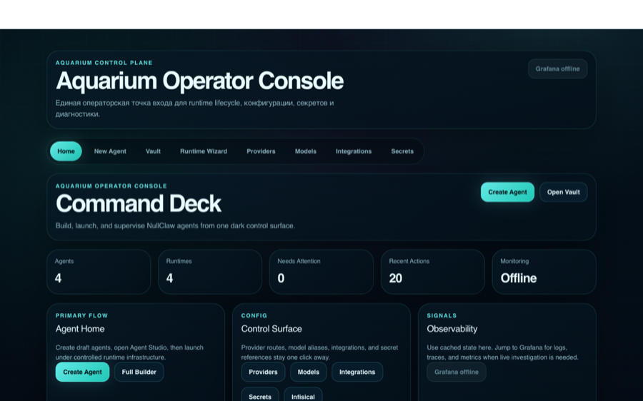
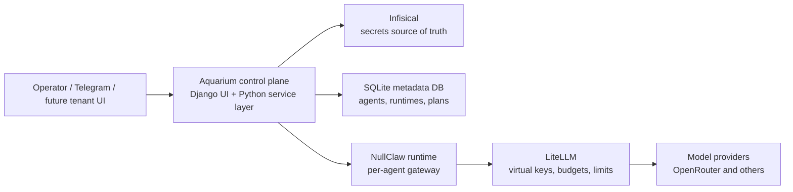
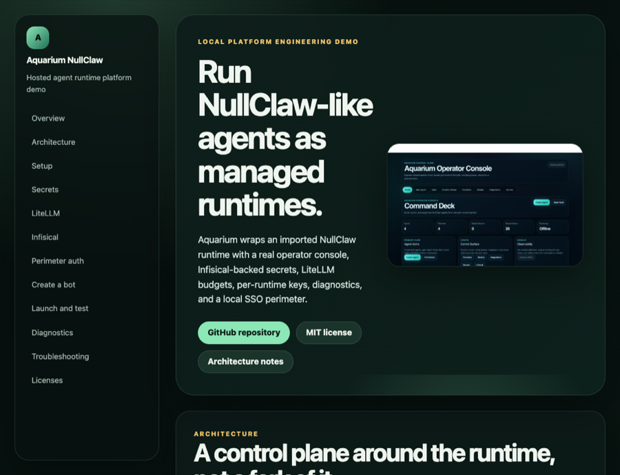
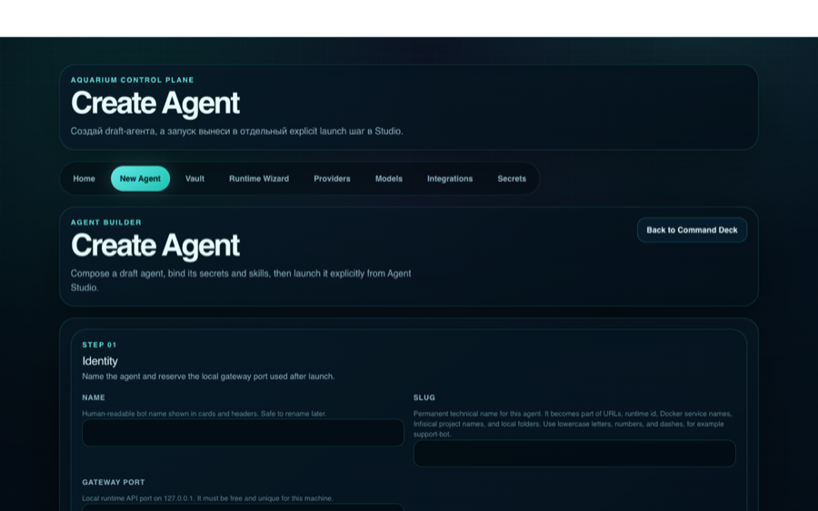
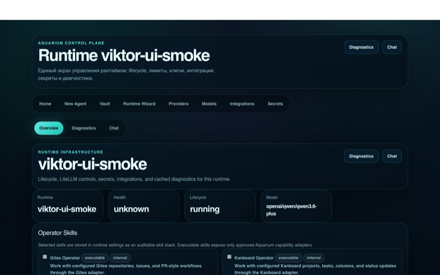
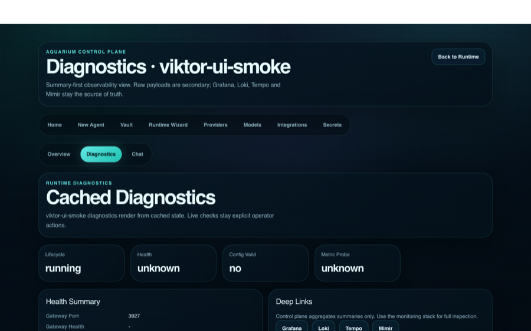
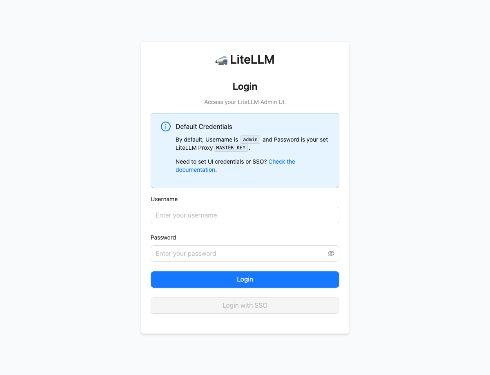

# Aquarium NullClaw


Aquarium is a local platform demo for running NullClaw-like agents as managed runtimes with an operator console, isolated secrets, and a LiteLLM gateway.

[Full documentation](https://ilyamirin.github.io/aquarium_nullclaw) · [License](LICENSE) · [Architecture](docs/architecture.md) · [Security model](docs/security-model.md)



## What This Demonstrates

- A Django operator console for creating, launching, inspecting, and debugging hosted agents.
- A Python 3.12 orchestration layer for runtime lifecycle, local state, Compose generation, Infisical wiring, and LiteLLM key provisioning.
- A strict trust boundary: provider master keys stay in LiteLLM core scope; NullClaw runtimes receive only per-runtime LiteLLM keys.
- Per-runtime budgets, RPM/TPM limits, key rotation, diagnostics, and internal test chat.
- A local Caddy + Authelia perimeter with trusted mkcert TLS for browser-facing operator surfaces.

Aquarium does **not** fork upstream NullClaw. The `nullclaw/` checkout is treated as imported runtime source; Aquarium is the hosting and operations layer around it.

## Architecture



The core platform rule is simple: hosted runtimes never receive provider master keys.

## Quickstart

This is a real-only demo. A full run needs Docker, Homebrew Python 3.12, the Infisical CLI, a real `OPENROUTER_API_KEY`, and, if Telegram is enabled, a real `TELEGRAM_BOT_TOKEN`.

```bash
/opt/homebrew/bin/python3.12 -m venv .venv
.venv/bin/pip install -e .[dev]
cp infisical-stack/.env.example infisical-stack/.env
make infisical-up
INFISICAL_API_URL=http://127.0.0.1:18080 infisical login
OPENROUTER_API_KEY=... TELEGRAM_BOT_TOKEN=... make demo-up
make perimeter-bootstrap
make perimeter-up
make perimeter-health
```

Open the operator console:

- [https://app.lvh.me/admin/](https://app.lvh.me/admin/)
- Authelia login: `admin` / `admin`
- Control-plane bootstrap login, if asked: `admin` / `admin`

Useful local surfaces:

- LiteLLM UI: [http://127.0.0.1:14000/ui/](http://127.0.0.1:14000/ui/)
- Infisical UI/API: [http://127.0.0.1:18080](http://127.0.0.1:18080)
- Perimeter Infisical route: [https://secrets.lvh.me](https://secrets.lvh.me)

Stop the default demo path:

```bash
make demo-down
make perimeter-down
```

## Screenshots

| Surface | Preview |
| --- | --- |
| GitHub Pages docs |  |
| Agent Builder |  |
| Runtime detail |  |
| Diagnostics |  |
| LiteLLM login |  |

## Main Components

| Component | Role | License / terms |
| --- | --- | --- |
| Aquarium | Local platform wrapper and control plane | [MIT](LICENSE) |
| [NullClaw](https://github.com/nullclaw/nullclaw) | Upstream agent runtime | [MIT](https://github.com/nullclaw/nullclaw/blob/main/LICENSE) |
| [Infisical](https://github.com/Infisical/infisical) | Secrets source of truth | [MIT expat with enterprise exceptions](https://github.com/Infisical/infisical/blob/main/LICENSE) |
| [LiteLLM](https://github.com/BerriAI/litellm) | LLM gateway, virtual keys, budgets | [MIT with enterprise exception](https://github.com/BerriAI/litellm/blob/main/LICENSE) |
| [Django](https://www.djangoproject.com/) | Control-plane web framework | [BSD-3-Clause](https://github.com/django/django/blob/main/LICENSE) |
| [Django Unfold](https://unfoldadmin.com/) | Admin UI toolkit | [MIT](https://github.com/unfoldadmin/django-unfold/blob/main/LICENSE) |
| [Typer](https://typer.tiangolo.com/), [Pydantic](https://docs.pydantic.dev/), [PyYAML](https://pyyaml.org/), [pytest](https://pytest.org/) | CLI, models, YAML, tests | MIT / BSD-family via upstream license files |
| [Requests](https://requests.readthedocs.io/) | HTTP client | [Apache-2.0](https://github.com/psf/requests/blob/main/LICENSE) |
| [Caddy](https://caddyserver.com/) | Local HTTPS reverse proxy | [Apache-2.0](https://github.com/caddyserver/caddy/blob/master/LICENSE) |
| [Authelia](https://www.authelia.com/) | Local SSO perimeter | [Apache-2.0](https://github.com/authelia/authelia/blob/master/LICENSE) |
| [Grafana](https://grafana.com/), [Loki](https://grafana.com/oss/loki/), [Tempo](https://grafana.com/oss/tempo/) | Optional local observability UI/logs/traces | AGPL-3.0 for core projects |
| [Grafana Alloy](https://grafana.com/oss/alloy-opentelemetry-collector/) | Telemetry collection | [Apache-2.0](https://github.com/grafana/alloy/blob/main/LICENSE) |
| [Docker](https://www.docker.com/), [PostgreSQL](https://www.postgresql.org/), [Redis](https://redis.io/) | Local runtime infrastructure | See upstream terms for selected image tags |
| [Prism.js](https://prismjs.com/) | Static docs syntax highlighting | [MIT](https://github.com/PrismJS/prism/blob/master/LICENSE) |
| [OpenRouter](https://openrouter.ai/) | External model provider route | Commercial API service, not bundled |

## Repository Map

- `controlplane/`: Django operator UI and internal API.
- `orchestrator/`: Python service layer and CLI for runtime lifecycle and LiteLLM/Infisical automation.
- `infisical-stack/`: local self-hosted Infisical.
- `litellm-stack/`: internal LiteLLM proxy and UI/API.
- `perimeter-stack/`: Caddy + Authelia browser perimeter.
- `monitoring-stack/`: optional Grafana/Alloy/Loki/Tempo/Mimir observability stack.
- `docs/`: public GitHub-facing documentation.
- `knowledge/`: internal operator memory and runbooks.
- `nullclaw/`: imported upstream runtime checkout; read-only for normal Aquarium work.

## Known Limits

- The demo is real-only; there is no fake provider mode in `main`.
- Fresh Telegram bots require a real `TELEGRAM_BOT_TOKEN`.
- LiteLLM RPM exhaustion maps cleanly to a NullClaw `RateLimited` experience.
- LiteLLM budget exhaustion currently reaches NullClaw as a generic `ApiError`.
- The local Redis image tag is intentionally documented but not yet production-pinned.
