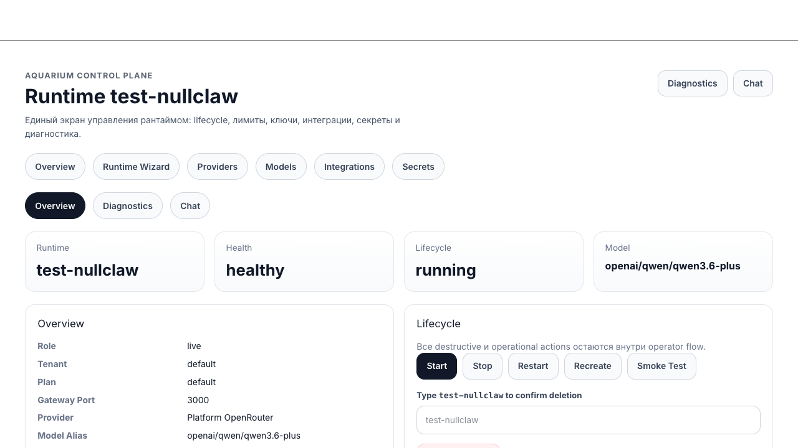
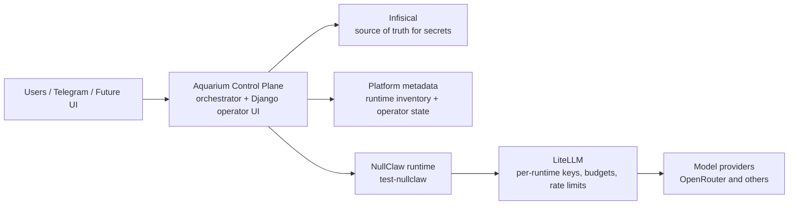
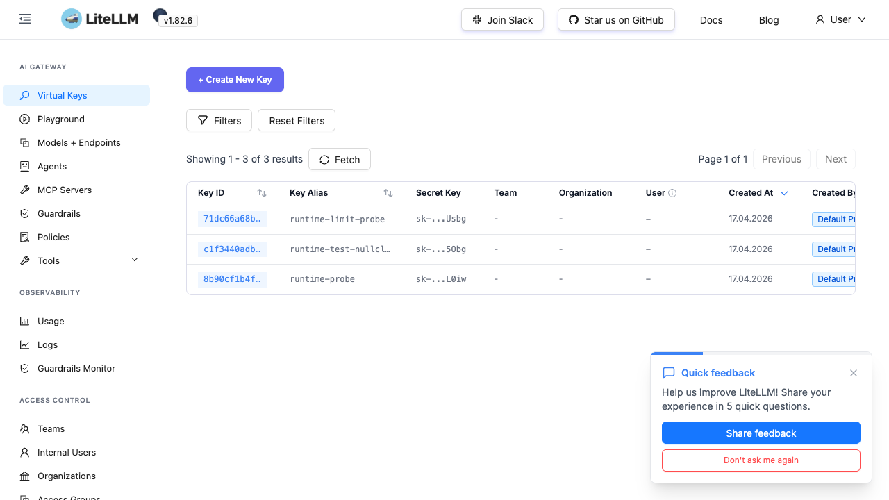
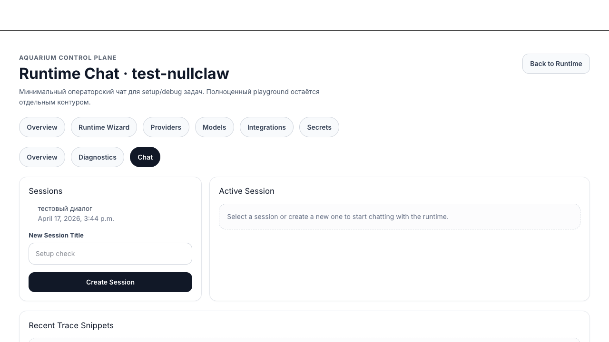

# Aquarium


Aquarium is a self-hosted platform demo for running, isolating, and operating NullClaw-like agent runtimes behind a proper secrets boundary and an LLM gateway.



## What I Built

This repository is not a fork of an agent runtime. It is the platform layer around one.

I built the control, security, and operations system required to run imported agent runtimes as isolated managed services:

- a Python orchestration layer for runtime provisioning, lifecycle control, compose generation, and state synchronization
- a shared service layer plus Django control plane for operator-facing management of runtimes, limits, keys, integrations, diagnostics, and debug chat
- an Infisical-first secret model with per-runtime secret scopes and strict separation from provider master credentials
- a LiteLLM gateway design where every runtime receives only its own virtual key, budget, and rate limits
- a local observability stack for logs, traces, metrics, and health monitoring
- the operational glue required to make these systems work together as one coherent platform

I did **not** build the upstream `nullclaw` runtime itself.
I intentionally treated it as imported source and built the hosting/control-plane boundary around it.

## Technical Value

The interesting part of this project is not “agent chat”.

The interesting part is the systems design:

- turning a raw runtime into a managed platform component
- enforcing secret isolation across runtime boundaries
- separating provider access from runtime execution
- making per-runtime revocation, quotas, and diagnostics operationally real
- keeping the runtime layer replaceable while the platform contract remains stable

This is closer to platform engineering and AI infrastructure than to building a chatbot UI.

## Architecture Decisions I’m Demonstrating

- upstream/runtime code is treated as an imported dependency, not casually modified
- control plane, CLI, and UI share one service layer instead of shelling out to each other
- runtime state is promoted into a DB-backed control plane rather than remaining ad hoc local files
- observability is designed as a first-class operator concern, not an afterthought
- secret handling is opinionated: provider master keys never enter runtime scopes
- the repository includes both demo ergonomics and operational documentation, not just code

## Skills Demonstrated

- platform and backend architecture
- infrastructure-aware product design
- secret and trust-boundary design
- orchestration and lifecycle management
- operator tooling and observability
- pragmatic integration of multiple systems into a single control surface
- moving from “works locally” to “can be operated as a system”

## Architecture



The platform rule is strict:

- NullClaw runtimes never receive provider master keys.
- Provider credentials live only in the LiteLLM core secret scope.
- Each runtime receives only its own LiteLLM key, the LiteLLM base URL, and non-LLM secrets such as Telegram credentials.

More detail:

- [Public architecture notes](docs/architecture.md)
- [Security model](docs/security-model.md)
- [Demo walkthrough](docs/demo-walkthrough.md)

## Quickstart

This repository is a real-only demo. You need real secrets to reproduce the full flow.

Prerequisites:

- Docker and Docker Compose
- Homebrew Python 3.12 at `/opt/homebrew/bin/python3.12`
- `infisical` CLI
- a real `OPENROUTER_API_KEY`
- optional: a real `TELEGRAM_BOT_TOKEN` for a fresh live bot bootstrap

Bootstrap:

```bash
/opt/homebrew/bin/python3.12 -m venv .venv
.venv/bin/pip install -e .[dev]
cp infisical-stack/.env.example infisical-stack/.env
make infisical-up
INFISICAL_API_URL=http://127.0.0.1:18080 infisical login
OPENROUTER_API_KEY=... TELEGRAM_BOT_TOKEN=... make demo-up
```

Health check:

```bash
make demo-check
```

Stop the demo path:

```bash
make demo-down
```

Default demo surfaces:

- Infisical: [http://127.0.0.1:18080](http://127.0.0.1:18080)
- LiteLLM UI: [http://127.0.0.1:14000/ui/](http://127.0.0.1:14000/ui/)
- Control plane: [http://127.0.0.1:15000/admin/](http://127.0.0.1:15000/admin/)
- `test-nullclaw` health: [http://127.0.0.1:3000/health](http://127.0.0.1:3000/health)

The bootstrap operator account for the local control plane is:

- username: `admin`
- password: `admin`

## Demo walkthrough

The recruiter-friendly path is:

1. Open the control plane and inspect `test-nullclaw`.
2. Open LiteLLM and inspect the runtime key and its limits.
3. Inspect diagnostics and the runtime chat/debug surface.
4. If Telegram is configured, send the live bot a message and verify it answers through LiteLLM.
5. Use the control plane or CLI to rotate or revoke the runtime key.

See the full guided path in [docs/demo-walkthrough.md](docs/demo-walkthrough.md).

## Screenshots

| Surface | Preview |
| --- | --- |
| Operator runtime detail |  |
| LiteLLM UI |  |
| Operator chat |  |

## Repository layout

- `orchestrator/`: Python 3.12 control plane and shared service layer
- `controlplane/`: Django + Unfold operator UI and internal JSON API
- `infisical-stack/`: local self-hosted Infisical deployment
- `litellm-stack/`: LiteLLM gateway and internal admin UI/API
- `monitoring-stack/`: optional observability stack kept out of the default demo path
- `knowledge/`: internal operator memory and source-of-truth
- `docs/`: public demo-oriented documentation
- `nullclaw/`: upstream runtime checkout, treated as imported and read-only here

Legacy/manual reference stacks:

- `nullclaw-stack/`
- `nullclaw-probe-stack/`

They stay in the repository as migration-era references only. They are not the primary path for the demo.

## Known limitations

- This is a real-only demo. There is no mock provider mode in `main`.
- Fresh live Telegram bootstrap still needs a real `TELEGRAM_BOT_TOKEN`.
- LiteLLM RPM exhaustion maps cleanly to a NullClaw `RateLimited` experience.
- LiteLLM budget exhaustion currently reaches NullClaw as a generic `ApiError`.
- Upstream `nullclaw/` is intentionally not patched in this wrapper repository.

## Internal vs public docs

- Public demo docs live in [docs/](docs/).
- Internal operator memory lives in [knowledge/](knowledge/).

If you want the broader operator runbooks and project memory, start with [knowledge/README.md](knowledge/README.md).
