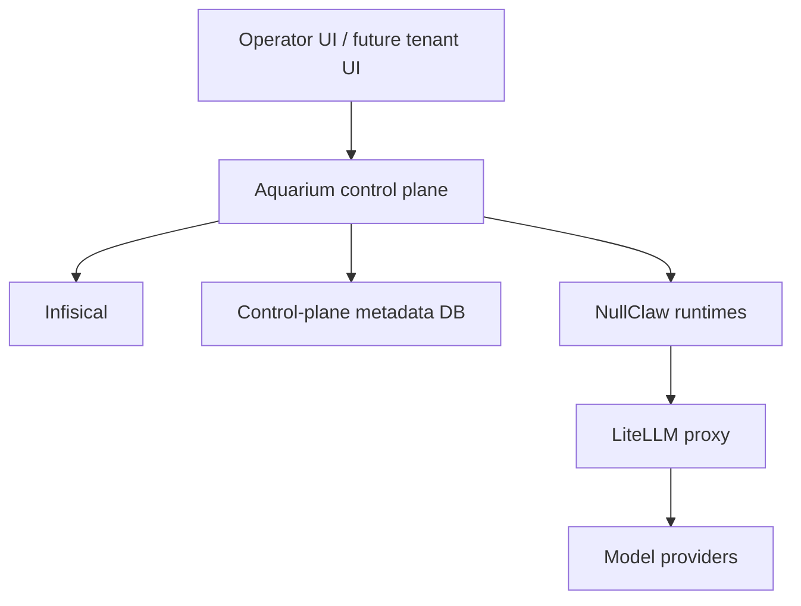

# Aquarium Architecture

Aquarium is a platform wrapper around an imported upstream NullClaw runtime. The project does not try to rewrite the runtime. It shows how hosted agent runtimes can be operated with a focused control plane, a clear secrets boundary, and a dedicated LLM gateway.

## Component roles

### `orchestrator/`

The Python 3.12 orchestrator is the shared control-plane layer. It manages:

- runtime lifecycle
- local runtime inventory
- generated Docker Compose for hosted runtimes
- Infisical project and secret wiring
- LiteLLM virtual key provisioning
- budget and limit updates

### `controlplane/`

The Django + Unfold surface is the human operator UI. It exposes:

- runtime inventory
- runtime detail pages
- limits and key actions
- diagnostics and chat surfaces
- provider, integration, and secret management

### `infisical-stack/`

Infisical is the source of truth for secrets. Runtime projects store:

- per-runtime LiteLLM keys
- Telegram credentials
- other runtime-scoped secrets

The LiteLLM core secret scope stores provider master credentials. Runtimes never receive those credentials.

### `litellm-stack/`

LiteLLM is the mandatory LLM gateway for hosted runtimes. It owns:

- per-runtime keys
- budgets and rate limits
- provider routing
- a small internal admin UI/API

### `nullclaw/`

The upstream NullClaw checkout is intentionally treated as imported source. Aquarium wraps it rather than editing it as part of normal platform work.

## Compose topology

The primary compose project names are part of the repo contract:

- `aquarium-infisical`
- `aquarium-litellm`
- `aquarium-nullclaw-runtimes`

Legacy/manual compose projects still exist as references only:

- `aquarium-nullclaw`
- `aquarium-nullclaw-probe`

Those legacy stacks are not the primary demo path.

## Default demo path

The minimal visible demo path is:

1. Infisical
2. LiteLLM
3. Django control plane
4. `test-nullclaw`

Monitoring stays in the repository but outside the default demo path, keeping the public story small and readable.
