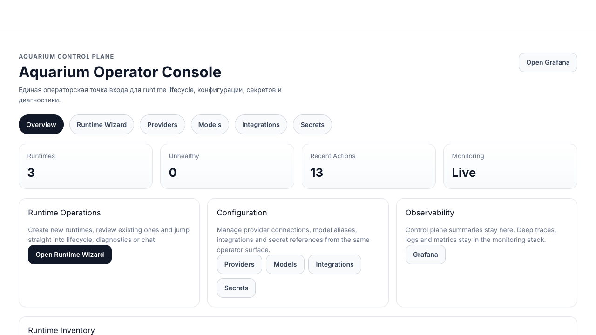

# Demo Walkthrough

This is the shortest path to show Aquarium as a platform demo rather than as a pile of local ops scripts.

## 1. Start the demo path

```bash
make demo-up
make demo-check
```

If you are bootstrapping from scratch, you need:

- a filled `infisical-stack/.env`
- an authenticated local Infisical CLI session
- a real `OPENROUTER_API_KEY`
- optionally a real `TELEGRAM_BOT_TOKEN`

## 2. Open the operator UI

Open [http://127.0.0.1:15000/admin/](http://127.0.0.1:15000/admin/).

Local bootstrap credentials:

- username: `admin`
- password: `admin`

Start with the `test-nullclaw` runtime page. It shows:

- health and lifecycle
- current model and gateway port
- per-runtime LiteLLM limits
- key rotation and revoke actions
- integrations and secret references
- diagnostics summaries


## 3. Open LiteLLM

Open [http://127.0.0.1:14000/ui/](http://127.0.0.1:14000/ui/).

Current local fallback login:

- username: `admin`
- password: the current `LITELLM_MASTER_KEY` value from the `litellm-core` Infisical project

Use LiteLLM to inspect:

- runtime keys
- budgets and limits
- model access
- recent usage/spend


## 4. Open diagnostics or operator chat

From the runtime page, open diagnostics or chat. This is the best place to show that the platform is not just provisioning runtimes; it is also exposing operator-friendly status and debugging surfaces.


## 5. Show the key platform boundary

The clean story to tell is:

1. Aquarium creates a per-runtime LiteLLM key.
2. Aquarium stores that key in Infisical.
3. Aquarium injects only that key into NullClaw.
4. NullClaw talks only to LiteLLM.
5. LiteLLM holds the provider master key and enforces budgets and rate limits.

That is the core platform capability this repository demonstrates.

## 6. Optional live chat proof

If `test-nullclaw` has Telegram configured, send the live bot a message and verify:

- the runtime answers
- the answer still goes through LiteLLM
- the provider key never appears in the runtime config or runtime secret scope

If Telegram is not configured, the runtime is still demoable through the built-in operator surfaces and one-shot runtime health/debug flow.

## 7. Lightweight image sequence

Use these images as a compact sequence when presenting the repository:

1. 
2. 
3. 
4. 

## 8. Shut the demo down

```bash
make demo-down
```
